# Churn Prediction for Bank Customer 
Creating a Machine Learning model to predict Customer who has the potential to churn. 

## Stage 0 
**Problem Statement**

Perusahaan Rakamin Bank Center (RBC) tidak memiliki model Machine Learning (ML) untuk memprediksi nasabah mana yang akan 
churn. Dari data historikal yang ada, diperoleh jumlah nasabah churn sebesar **20,37%** dari keseluruhan data. Mengacu pada laman 
uxpressia.com tentang "*How to Approach Customer Churn Measurements in Banking*", toleransi nasabah churn maksimal sebesar 
**10%**.  Sementara itu, jumlah nasabah churn pada data yang kita miliki melebihi batas toleransi tersebut. Dengan model ML yang dibuat, 
diharapkan menjadi acuan bagi tim bisnis untuk mengambil langkah strategi mengatasi nasabah yang terdeteksi churn. 

----------
**Goals** 

Membuat model Machine Learning dengan tingkat akurasi > **70%** dan tingkat presisi > () untuk membantu bank Rakamin Bank Center (RBC) 
dalam memprediksi nasabah yang akan churn dan membantu tim bisnis dalam menentukan strategi terhadap nasabah yang akan churn

---------
**Objectives** 

* Mengidentifikasi variabel yang memiliki relevansi dengan keputusan nasabah untuk berhenti berlangganan
* Mempersiapkan data historikal yang digunakan untuk model Machine Learning
* Membangun model prediktif untuk mengklasifikasikan nasabah yang berpotensi churn
* Melakukan optimasi model sehingga mendapatkan hasil yang terbaik

----------
Bussines Metrics

Untuk mengukur keberhasilan objective tersebut dengan **churn rate**. Kami juga mengukur metric sekunder dengan tingkat **akurasi model**.

## Stage 1

**Exploratory Data Analysis**

Kami menggunakan data set bank customers yang berasal dari [kaggle.com](https://www.kaggle.com/datasets/adammaus/predicting-churn-for-bank-customers). Berikut beberapa insight yang kami temukan.

### Descriptive Statistic
-----

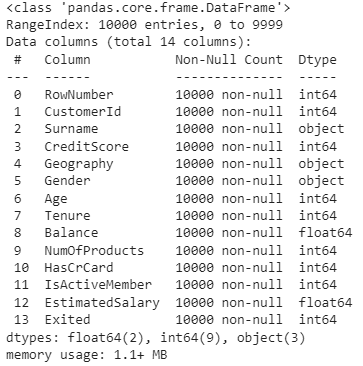

Dataset berisi 10.000 row data dengan 14 fitur kolom. Kolom Exited sebagai variable target. Di dalam data tidak ada *missing value* untuk semua atribut.

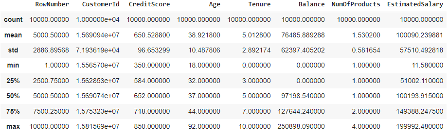

Jarak antara nilai median dan rata - rata CreditScore, Age, EstimatedSalary, dan Tenure  sangat dekat. Sehingga berdasarkan angkanya, sebaran data cenderung memiliki distribusi normal. Sedangkan untuk fitur balance, jarak antara nilai median dan rata - rata berjauhan sehingga cenderung memiliki distibusi skew dan memiliki nilai outlier yang ekstrim.

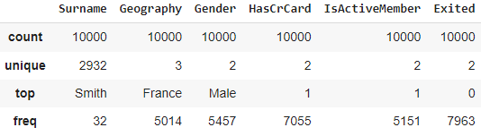

Fitur Geography memiliki 3 nilai unik dengan dominasi negara France (50%). Fitur Gender dengan 2 nilai unik. Fitur HasCard dan IsActiveMember dengan 2 nilai unik. Sedangkan variable target Exited memiliki 2 nilai unik dengan jumlah nilai (1) atau nasabah sudah tidak menggunakan jasa bank lagi sebesar **21%**.

### Univariate Analysis
-----

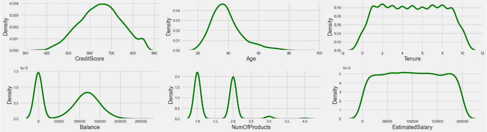

Fitur CreditScore, Age, Balance, dan EstimateSalary memiliki **distribusi normal**.Fitur Tenure memiliki bentuk **uniform** bertipe diskrit karena mengandung banyak lonjakan di sekitar area pemusatan data, oleh karenanya, tidak bisa dikatakan sebagai distribusi yang datanya berbentuk normal dan bisa diasumsikan sebagai bentuk data numerik bertipe kategorikal. Sedangkan fitur numOfProduct memiliki **distribusi bimodal**.

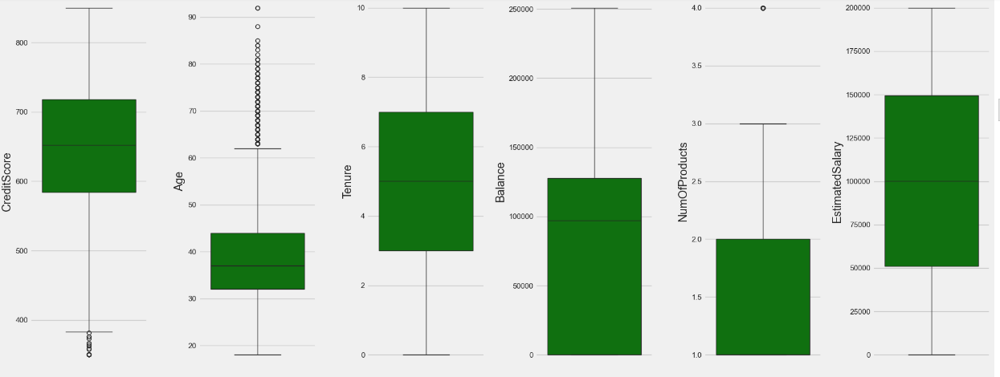

Fitur CreditScore dan Age  memiliki **nilai outlier** melewati batas bawah whisker pada boxplot. Fitur NumOfProduct memiliki **satu outlier**. Fitur numerical lainnya **tidak memiliki outlier**.

Variabel target exited memiliki bentuk **data tidak seimbang**. Variabel ini membutuhkan upaya metode oversampling atau undersampling sebagai langkah penanganan selanjutnya untuk training machine learning. 
Pada semua fitur dengan tipe categorical tidak seimbang ketika data dipecah berdasarkan variabel targetnya. Diperlukan pemerataan data agar performa *machine learning* menjadi lebih baik.

### Multivariate Analysis
-----
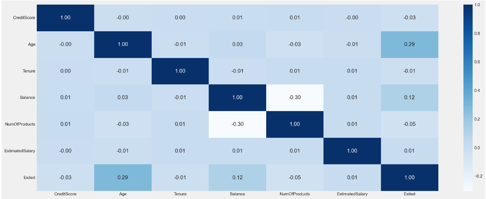

Semua fitur numerikal cenderung memiliki hubungan korelasi yang lemah (0 - 0,3) dengan variabel target exited. Oleh karena itu **tidak ada hal yang mengindikasikannya adanya multikolinearitas**.  

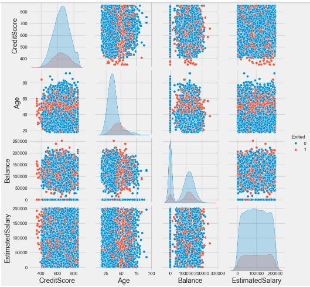

Berdasarkan plot diatas, tidak terlihat adanya segmentasi tertentu pada distribusi antara nasabah churn dan non-churn terhadap masing-masing fitur. Namun, pada fitur Age, rentang nilai area pemusatan lebih bergeser ke arah yang lebih tua terhadap distribusi nasabah yang churn. 

Tidak terlihat adanya segmentasi tertentu pada distribusi data nasabah churn dan non-churn terhadap hubungan fitur (scatter plot). Hal tersebut **dapat berpotensi machine learning mengalami penurunan akurasi**.

-----
### Follow-Up Preprocessing

1. Menghapus beberapa fitur yang tidak relevan untuk pemodelan ML seperti fitur rownumbers, CustomerID, dan Surname.

2. Mengecek apakah ada sebuah data duplikat, bila ada lakukan penghapusan pada data duplikat tersebut.

3. Menghandle outliers terhadap fitur skor kredit dan usia dengan metode z-score atau IQR (keduanya akan dibandingkan untuk mengukur performa ML), selain itu bisa juga menggunakan model ML lainnya yang sekiranya robust terhadap outlier.

4. Melakukan fitur engineering terhadap penambahan fitur baru guna meningkatkan performa dari model ML.

5. Melakukan data scaling terhadap beberapa fitur seperti skor kredit menggunakan normalisasi, pada fitur saldo menggunakan normalisasi/standarisasi, dan pada fitur gaji menggunakan metode log-transformation. Setelah itu lakukan pengecekan bentuk distribusi datanya kembali apakah sudah mendekati normal atau belum.

6. Melakukan fitur encoding terhadap fitur kategorikal dengan metode one-hot encoding pada fitur jenis kelamin dan metode label encoding pada fitur geografi. Kemudian cek kembali apakah adanya indikasi multikolinearitas setelah dilakukan fitur encoding.

7. Melakukan proses menangani data yang tidak seimbang terhadap variabel target menggunakan metode over sampling ataupun under sampling. Keduanya akan dilakukan perbandingan akurasi terhadap model ML.

-----
## Bussines Insight

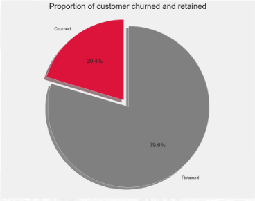
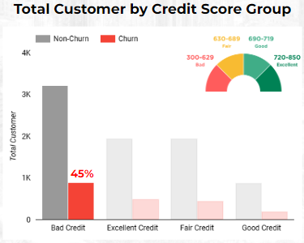

* Sekitar **20% nasabah sudah berhenti** menggunakan jasa bank atau tidak menggunakan produk yang ada pada bank
* Nasabah churn terjadi pada semua tipe CreditScore dan sebanyak **45%** didominasi oleh status kredit buruk *(Bad Credit)*.

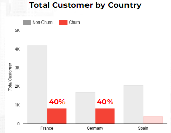
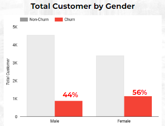

* Akumulasi persentase dari nasabah churn yaitu sekitar **80%** berasal dari negara **Prancis** dan **Jerman**.
* Sekitar **50%** nasabah churn bersumber dari jenis kelamin perempuan 

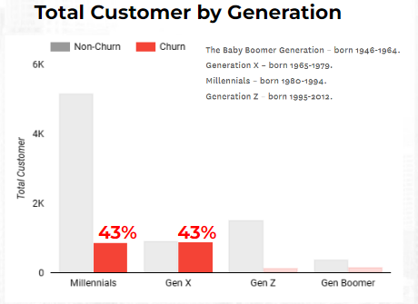
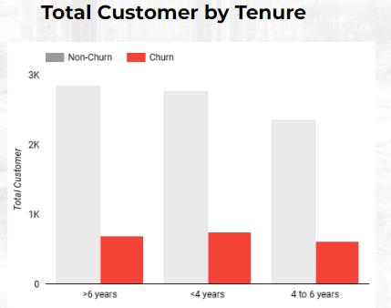

* Akumulasi persentase dari nasabah churn sekitar **86%** yang berasal dari **generasi Milenials** dan **generasi X**.
* Tidak ada kriteria tertentu mengenai faktor penyebab nasabah churn berdasarkan tenure

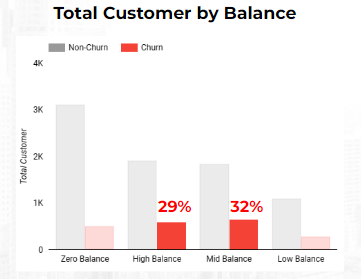
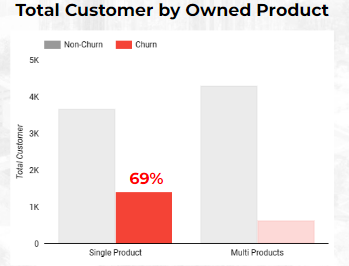

* Akumulasi persentase dari nasabah churn sekitar **61%** berasal dari nasabah dengan rentang jumlah balance menengah ke atas. 
* Sebanyak **69%** nasabah churn disebabkan karena hanya memiliki **satu jenis produk saja**. 

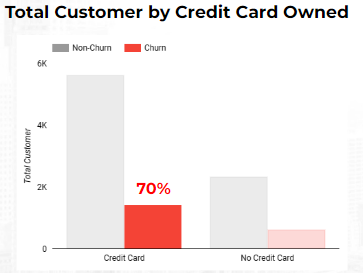
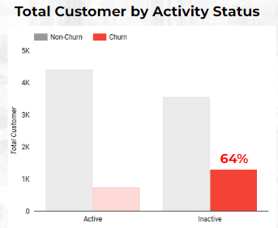

* Sebanyak 70% nasabah churn ternyata sudah memiliki kartu kredit
* Sebanyak 64% nasabah churn disebabkan karena tidak aktif kembali dalam melakukan aktivitas transaksi