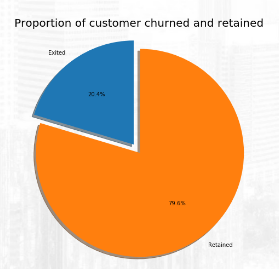

# Churn Prediction for Bank Customer 
Creating a Machine Learning model to predict Customer who has the potential to churn. 

## Stage 0 
**Problem Statement**

Perusahaan Rakamin Bank Center (RBC) tidak memiliki model Machine Learning (ML) untuk memprediksi nasabah mana yang akan 
churn. Dari data historikal yang ada, diperoleh jumlah nasabah churn sebesar **20,37%** dari keseluruhan data. Mengacu pada laman 
uxpressia.com tentang "*How to Approach Customer Churn Measurements in Banking*", toleransi nasabah churn maksimal sebesar 
**10%**.<br> Sementara itu, jumlah nasabah churn pada data yang kita miliki melebihi batas toleransi tersebut. Dengan model ML yang dibuat, 
diharapkan menjadi acuan bagi tim bisnis untuk mengambil langkah strategi mengatasi nasabah yang terdeteksi churn. 

----------
**Goals** 

Membuat model Machine Learning dengan tingkat akurasi > **70%** dan tingkat presisi > () untuk membantu bank Rakamin Bank Center (RBC) 
dalam memprediksi nasabah yang akan churn dan membantu tim bisnis dalam menentukan strategi terhadap nasabah yang akan churn

---------
**Objectives** 

* Mengidentifikasi variabel yang memiliki relevansi dengan keputusan nasabah untuk berhenti berlangganan
* Mempersiapkan data historikal yang digunakan untuk model Machine Learning
* Membangun model prediktif untuk mengklasifikasikan nasabah yang berpotensi churn
* Melakukan optimasi model sehingga mendapatkan hasil yang terbaik

----------
Bussines Metrics

Untuk mengukur keberhasilan objective tersebut dengan **churn rate**. Kami juga mengukur metric sekunder dengan tingkat **akurasi model**.

## Stage 1

**Exploratory Data Analysis**


Kami menggunakan data set bank customers yang berasal dari [kaggle.com](https://www.kaggle.com/datasets/adammaus/predicting-churn-for-bank-customers). Berikut beberapa insight yang kami temukan.

### Descriptive Statistic
-----


Dataset berisi 10.000 row data dengan 14 fitur kolom. Kolom Exited sebagai variable target. Di dalam data tidak ada *missing value* untuk semua atribut.


Jarak antara nilai median dan rata - rata CreditScore, Age, EstimatedSalary, dan Tenure  sangat dekat. Sehingga berdasarkan angkanya, sebaran data cenderung memiliki distribusi normal. Sedangkan untuk fitur balance, jarak antara nilai median dan rata - rata berjauhan sehingga cenderung memiliki distibusi skew dan memiliki nilai outlier yang ekstrim.


Fitur Geography memiliki 3 nilai unik dengan dominasi negara France (50%). Fitur Gender dengan 2 nilai unik. Fitur HasCard dan IsActiveMember dengan 2 nilai unik. Sedangkan variable target Exited memiliki 2 nilai unik dengan jumlah nilai (1) atau nasabah sudah tidak menggunakan jasa bank lagi sebesar **21%**.

### Univariate Analysis
-----


Fitur CreditScore, Age, Balance, dan EstimateSalary memiliki **distribusi normal**.Fitur Tenure memiliki bentuk **uniform** bertipe diskrit karena mengandung banyak lonjakan di sekitar area pemusatan data, oleh karenanya, tidak bisa dikatakan sebagai distribusi yang datanya berbentuk normal dan bisa diasumsikan sebagai bentuk data numerik bertipe kategorikal. Sedangkan fitur numOfProduct memiliki **distribusi bimodal**.


Fitur CreditScore dan Age  memiliki **nilai outlier** melewati batas bawah whisker pada boxplot. Fitur NumOfProduct memiliki **satu outlier**. Fitur numerical lainnya **tidak memiliki outlier**.



Variabel target exited memiliki bentuk **data tidak seimbang**. Variabel ini membutuhkan upaya metode oversampling atau undersampling sebagai langkah penanganan selanjutnya untuk training machine learning. 
Pada semua fitur dengan tipe categorical tidak seimbang ketika data dipecah berdasarkan variabel targetnya. Diperlukan pemerataan data agar performa *machine learning* menjadi lebih baik.

### Multivariate Analysis
-----


Semua fitur numerikal cenderung memiliki hubungan korelasi yang lemah (0 - 0,3) dengan variabel target exited. Oleh karena itu **tidak ada hal yang mengindikasikannya adanya multikolinearitas**. <br>


Berdasarkan plot diatas, tidak terlihat adanya segmentasi tertentu pada distribusi antara nasabah churn dan non-churn terhadap masing-masing fitur. Namun, pada fitur Age, rentang nilai area pemusatan lebih bergeser ke arah yang lebih tua terhadap distribusi nasabah yang churn.<br>

Tidak terlihat adanya segmentasi tertentu pada distribusi data nasabah churn dan non-churn terhadap hubungan fitur (scatter plot). Hal tersebut **dapat berpotensi machine learning mengalami penurunan akurasi**.

-----
### Follow-Up Preprocessing

1. Menghapus beberapa fitur yang tidak relevan untuk pemodelan ML seperti fitur rownumbers, CustomerID, dan Surname.

2. Mengecek apakah ada sebuah data duplikat, bila ada lakukan penghapusan pada data duplikat tersebut.

3. Menghandle outliers terhadap fitur skor kredit dan usia dengan metode z-score atau IQR (keduanya akan dibandingkan untuk mengukur performa ML), selain itu bisa juga menggunakan model ML lainnya yang sekiranya robust terhadap outlier.

4. Melakukan fitur engineering terhadap penambahan fitur baru guna meningkatkan performa dari model ML.

5. Melakukan data scaling terhadap beberapa fitur seperti skor kredit menggunakan normalisasi, pada fitur saldo menggunakan normalisasi/standarisasi, dan pada fitur gaji menggunakan metode log-transformation. Setelah itu lakukan pengecekan bentuk distribusi datanya kembali apakah sudah mendekati normal atau belum.

6. Melakukan fitur encoding terhadap fitur kategorikal dengan metode one-hot encoding pada fitur jenis kelamin dan metode label encoding pada fitur geografi. Kemudian cek kembali apakah adanya indikasi multikolinearitas setelah dilakukan fitur encoding.

7. Melakukan proses menangani data yang tidak seimbang terhadap variabel target menggunakan metode over sampling ataupun under sampling. Keduanya akan dilakukan perbandingan akurasi terhadap model ML.

-----
## Bussines Insight


* Sekitar **20% nasabah sudah berhenti** menggunakan jasa bank atau tidak menggunakan produk yang ada pada bank
* Nasabah churn terjadi pada semua tipe CreditScore dan sebanyak **45%** didominasi oleh status kredit buruk *(Bad Credit)*.


* Akumulasi persentase dari nasabah churn yaitu sekitar **80%** berasal dari negara **Prancis** dan **Jerman**.
* Sekitar **50%** nasabah churn bersumber dari jenis kelamin perempuan 


* Akumulasi persentase dari nasabah churn sekitar **86%** yang berasal dari **generasi Milenials** dan **generasi X**.
* Tidak ada kriteria tertentu mengenai faktor penyebab nasabah churn berdasarkan tenure


* Akumulasi persentase dari nasabah churn sekitar **61%** berasal dari nasabah dengan rentang jumlah balance menengah ke atas. 
* Sebanyak **69%** nasabah churn disebabkan karena hanya memiliki **satu jenis produk saja**. 


* Sebanyak **70%**nasabah churn ternyata sudah memiliki kartu kredit
* Sebanyak **64%** nasabah churn disebabkan karena tidak aktif kembali dalam melakukan aktivitas transaksi


Seperti yang sudah disebutkan sebelumnya bahwa generasi milenial dan generasi X merupakan generasi dengan akumulasi jumlah churn terbanyak. **53%** nasabah churn pada generasi milenial dan generasi x memiliki rentang jumlah balance menengah ke atas.


Terlihat salah satu faktor generasi x dan milenisal sudah tidak menggunakan produk bank kembali yaitu karena **banyak yang tidak aktif kembali dalam melakukan aktivitas transaksinya**


Sebanyak **60%** nasabah pada kedua generasi tersebut tidak menggunakan produk bank kembali namun memiliki kartu kredit. Perlu dilakukan pengecekan lebih dalam mengenai status skor kredit mereka.


 
Sebanyak **38%** nasabah kedua generasi tersebut mempunyai status skor kredit yang buruk, lebih tinggi dibandingkan status lainnya.  


Nasabah churn dari generasi milenials dan gen x dengan status credit score buruk banyak terjadi pada negara **Prancis dan Jerman**.


Nasabah churn dari generasi millenials dan gen x dengan status kredit buruk banyak menggunakan **satu jenis produk saja**. 

## Sumary Business Insight
Beberapa rangkuman insight yang diperoleh dari hasil analisa data adalah :

1. Jumlah nasabah churn sebanyak 20% dari keseluruhan nasabah.
2. 45% nasabah churn memiliki status skor kredit yang buruk.
3. 80% nasabah churn berasal dari negara prancis dan jerman.
4. Rasio persentase nasabah churn berasal dari 56% perempuan dan 44% laki-laki.
5. Akumulasi persentase dari nasabah churn sekitar 86% yang berasal dari generasi Millennials dan generasi X. Pada generasi tersebut, mereka memiliki jumlah balance dengan rentang menengah ke atas.
6. Akumulasi persentase dari nasabah churn sekitar 61% yang berasal dari nasabah dengan rentang jumlah balance menengah ke atas.
7. 69% nasabah churn hanya memiliki satu jenis produk saja.
8. 70% nasabah churn memiliki kartu kredit.
9. 64% nasabah churn memiliki riwayat tidak aktif dalam melakukan aktivitas transaksinya. 
10. Perbandingan nasabah yang masih menggunakan produk bank antara berstatus aktif dan non-aktif adalah 56 : 44%. Mereka churn karena banyak yang sudah tidak aktif dalam melakukan aktivitas transaksi.
11. Mayoritas dari nasabah churn tersebut memiliki kartu kredit. Namun mayoritas juga skor kartu kredit mereka berstatus buruk. Kemungkinannya salah satu penyebab adalah produk yang dimiliki hanya satu jenis saja.

## Business Recomendation 
Berikut beberapa rekomendasi bisnis yang kami sarankan berdasarkan insight yang didapatkan : 

1. Nasabah berstatus aktif pada gen millennials dan gen X yang memiliki jumlah balance menengah ke atas, diberikan suatu **program loyalti** berupa **reward poin** agar mereka terus melakukan aktivitas transaksi.
2. Nasabah berstatus tidak aktif pada generasi dan jumlah saldo yang sama dengan di atas, diberikan **push notification** melalui SMS kepada nasabah yang berasal dari **Perancis** dengan konten berupa **promosi diskon** belanja berkategori lifestyle di merchant tertentu, sedangkan kepada nasabah yang berasal dari **Jerman** kontennya berupa promosi diskon belanja berkategori luxury item di merchant tertentu.
3. Meningkatkan **kualitas produk** yang dimiliki agar nasabah tertarik menggunakan lebih dari satu jenis produk.
4. Nasabah dengan status skor kredit yang buruk diberikan **potongan bunga pinjaman** saat pembayaran tagihan kredit.

----

## Stage 2

Tindak lanjut dari proses stage 1 akan dilakukan beberapa step preprocessing berdasarkan dari hasil analisis data. 


Di dalam dataset dengan isi 10.000 baris dan 14 kolom dengan kolom **Exited** sebagai variable target. Semua atribut sudah memiliki tipe data dan isi data yang sudah sesuai.


Variabel target yang digunakan untuk machine learning adalah kolom **exited** dan sisanya adalah variabel fitur.
Metode ML yang digunakan adalah **tipe supervised learning** sebab labelnya sudah disediakan dan karena bentuknya
merupakan nilai binary atau kategorikal, maka metode ML yang digunakan adalah **klasifikasi**.


Berikut ini merupakan keterangan dari masing - masing atribut

* CustomerId : Nomor akun
* Surname : Nama belakang nasabah
* CreditScore : Nilai kredit
* Geography : Negara tempat tinggal nasabah
* Gender : Jenis kelamin
* Age : Usia nasabah
* Tenure : lamanya menjadi nasabah
* Balance : Saldo rekening
* NumOfProducts : Jumlah produk yang dibeli nasabah melalui bank
* HasCrCrad : Kepemilikan kartu kredit
* isActiveMember : Keaktifan nasabah
* EstimatedSalary : Gaji nasabah
* Exited : Keputusan nasabah churn atau tidak 

----

Berikut ini langkah - langkah preprocessing yang kami lakukan untuk dataset 

### Removing Irrelevant Features (part 1)
```
df_bank = df_bank.drop(columns = ['RowNumber'])
```

Melakukan penghapusan feature row number untuk mengecek apakah ada data duplikat. 

### Removing Duplicates 


**tidak ditemukan adanya data duplikat**

### Removing Irrelevant Features (Part 2)

```
df_bank = df_bank.drop(columns = ['CustomerId', 'Surname'])
```


Kami menghapus feature CustomerId dan Surename, karena feature tersebut tidak memberikan informasi yang penting untuk digunakan pada proses klasifikasi.

### Handling Missing Value


Kami melakukan pengecekan apakah terdapat nilai kosong di dalam data. Hasilnya tidak ditemukan nilai kosong atau missing value dan semua nilai pada feature dengan tipe kategorikal juga relevan terhadap nama kolomnya.

### Feature Encoding


Di dalam dataset terdapat 2 feature kategorikal yang perlu dilakukan encoding, feature tersebut adalah Geography dan Gender. Pada feature Gender dilakukan encoding dengan menggunakan **label encoding** karena fitur tersebut hanya memiliki 2 nilai saja. Untuk feature Geography kami lakukan **one-hot encoding**, karena feature tersebut memiliki lebih dari 2 jenis dan bukan bersifat ordinar atau memiliki tingkatan. 

```
# convert Geography feature from categorical into numerical by using one-hot encoding

from sklearn.preprocessing import OneHotEncoder 
  
## Converting type of columns to category 

df_bank['Geography'] = df_bank['Geography'].astype('category') 
# df_bank['Gender'] = df_bank['Gender'].astype('category')
  
## Assigning numerical values and storing it in another columns

df_bank['Geo_new'] = df_bank['Geography'].cat.codes
# df_bank['Gender_new'] = df_bank['Gender'].cat.codes
   
## Create an instance of One-hot-encoder 

enc = OneHotEncoder() 
  
## Passing encoded columns 
  
enc_data = pd.DataFrame(enc.fit_transform( 
    df_bank[['Geo_new']]).toarray()) 
  
## Merge with main

df_bank = df_bank.join(enc_data)

## rename the column

df_bank = df_bank.rename(columns={0 : "is_France", 1 : "is_Germany", 2 : "is_Spain"}) #3 : "is_Female", 4 : "is_Male"})

## drop irrelevant column

df_bank = df_bank.drop(columns = ['Geography', 'Geo_new']) #, 'Gender', 'Gender_new'])

```


setelah melakukan encoding, kami akan melakukan pengecekan apakah feature hasil encoding memiliki **pengaruh signifikan** terhadap target serta apakah ada **indikasi multikolinearitas antar feature**. Untuk melakukan hal tersebut,
kami menggunakan metode test statistik **chi2** dan nilai  **VIF (variance Inflation Factor)**. 


Hasil uji statistik chi2, menunjukan hanya feature **'HasCrCard'** yang **tidak memiliki pengaruh signifikan** *(p > 0.05)* terhadap target. Feature hasil encoding menunjukan feature **memiliki pengaruh signifikan** (p < 0.05) terhadap target.


Hasil uji statistik vif menujukan tiga feature baru hasil encoding memiliki **nilai VIF > 5.** Bisa diartikan ada indikasi multikolinearitas pada tiga feature tersebut. Sebagai langkah lanjutan akan dilakukan penggabungan feature is_Germany dengan is_Spain menjadi not_France apabila model mengalami overfitting.

### Feature Engineering

```
# balance per salary

df_bank_new['BalanceperSalary'] = df_bank_new['Balance'] / df_bank_new['EstimatedSalary']
```
Kami menambahkan feature baru yaitu **BalanceperSalary**

### Feature Transformation (Scaling)

```
# Standardization

from sklearn.preprocessing import StandardScaler
ss = StandardScaler()

numerical_features = X.columns.to_list()
for n in numerical_features:
  scaler = ss.fit(X_train[[n]])
  X_train[n] = scaler.transform(X_train[[n]])
  X_test[n] = scaler.transform(X_test[[n]])

```

Kami melakukan scaling data pada data training dan data testing dengan **metode standarisasi** agar semua fitur yang ada memiliki bentuk distribusi mendekati normal dan nilai jarak min-max antar feature tidak terlalu jauh

----

## Stage 3

### Spliting Data Training and Testing 

```
# Split the data into training and testing with the proportion of 70:30

X = df_bank_new.drop(columns=['Exited'])
y = df_bank_new[['Exited']]

from sklearn.model_selection import train_test_split
X_train, X_test, y_train, y_test = train_test_split(X, y, test_size=0.3, random_state=42)
```

Pada Stage 3 ini kami memutuskan untuk melakukan spliting data testing dan data training dengan proporsi pembagian yaitu 70 : 30. Spliting Data disini dilakukan untuk data selanjutnya dilakukan proses handling outlier.

### Checking Outlier


Setelah kami lakukan visualisasi terhadap data training terdapat feature yang memiliki outlier antara lain feature Balancepersalary, Age dan CreditScore.

### Handling Outlier

```
# Removing outliers using Z-Score

from scipy import stats

print(f'Jumlah baris sebelum memfilter outlier {len(data_train)}')


for col in ['BalanceperSalary', 'Age', 'CreditScore']:
    zscore = np.abs(stats.zscore(data_train[col]))
    filtered_entries = (zscore < 3)

data_train = data_train[filtered_entries]

print(f'Jumlah baris setelah memfilter outlier: {len(data_train)}')

```

Kami menghapus outlier yang terdapat pada feature BalanceperSalary, Age dan CreditScore menggunakan **Z-Score**. Penghapusan outlier juga dilakukan pada data untuk cross validation. Selanjutnya dilakukan feature scaling dengan standarization seperti pada Stage 2. Proses ini dilakukan untuk data naive spliting dan data cros validation. 

### Handling Data Imbalance Dataset

Pada dataset yang digunakan terjadi ketidakseimbangan proporsi data pada feature target yaitu 


Kami akan melakukan balancing data dengan metode **Undersampling**. Proses ini kami lakukan pada naive spliting data dan data cross validation.

```
# using undersamping for majority class with the proportion feature target is 70:30

from imblearn import under_sampling
X_under, y_under = under_sampling.RandomUnderSampler(random_state = 42, sampling_strategy = 0.428).fit_resample(X_train, y_train)
```
Yang selanjutnya dilakukan data split untuk naive spliting data dan Cross Validation Data.

----
## Modeling

Kami melakukan experimen untuk memilih model dari beberapa algoritma. Kami memilih metric evaluasi **F1 score** sebagai metrics utama dalam pemilihan model. F1 score kami pertimbangan sebagai metric evaluasi karena adanya data imbalance dan kami fokus pada pemilihan customer yang berpotensi akan churn dengan mempertimbangkan biaya marketing yang akan dikeluarkan. Kami juga menggunakan metric **Recall** dan **ROC-AUC** sebagai metrics pendukung.

### Logistic Regression

Kami melakukan modeling dengan logistic regression sebagai basis algoritma. 


Hasil modeling logistic regression pada metric F1 score, Recall dan ROC-AUC menunjukan hasil yang **underfiting**, tidak menujukan adanya overfitting untuk semua metrics evaluasi. 

Kami juga melakukan hyperparameter tunning untuk algoritma Logistic Regression dengan menggunakan **GridSearch** dan mendapatkan hasil berikut ini 


Hyperparameter yang kami tunning yaitu C, penalty dan solver parameter. Pada hasil metric evaluasi tidak menunjukan perubahan setelah dilakukan hyperparameter tunning. 

### KNN (K-Nearest Neighbours)


Kami melakukan modeling dengan algoritma KNN (K-Nearest Neighbours) dan mendapatkan hasil performansi underfitting dan overfiting pada metric evaluasi.


Setelah dilakukan hyperparamter tunning pada parameter n_neigbors, weight, dan P, hasil performansi menunjukan F1 score tidak mendapatkan nilai yang baik, namun terjadi peningkatan performansi pada metric ROC-AOC. 

### SVM (Support Vector Machine)


 Hasil performansi menggunakan algoritma SVM mengalami underfitting untuk metrics F1 score, Recall dan ROC-AOC.


Kami melakukan hyperparameter tunning untuk parameter kernel, C parameter, Gamma, dan Class Weight. 
Hasil performansi setelah dilakukan hyperparameter tunning menunjukan hasil metric F1 score dan Recall masih tetap underfit. Metric ROC-AUC menunjukan hasil yang baik untuk model ini.

### Random Forest


Kami melakukan modeling dengan algoritma random forest. Performansi yang dihasilkan pada metric F1 score dan Recall mengalami undefitting, sedangkan metric ROC-AOC mengalami overfitting.


Kami melakukan hyperparameter tunning untuk algorima random forest pada parameter class weight, min samples split, min weight fraction leaf, max lead nodes dan max samples.

Hasil performansi tidak lagi mengalami overfitting untuk semua metrics. Metric Recall mengalami peningkatan nilai. ROC - AOC mendapatkan nilai yang baik setelah dilakukan hyperparameter tunning. Dari hasil performansi tersebut, algoritma ini dapat dipertimbangkan sebagai algoritma yang digunakan untuk menentukan prediksi churn nasabah bank.

### Adaboost


Hasil performansi dari model dengan algoritma Adaboost menunjukan metric F1 score dan Recall mengalami underfitting dan menunjuka bestfit pada metric ROC-AOC.


### XGboost


Kami juga melakukan modeling untuk algoritma XGboost. Metric F1 score dan Recall mengalami underfitting, sementara ROC-AOC mengalami overfitting.

